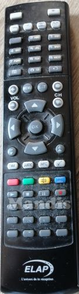
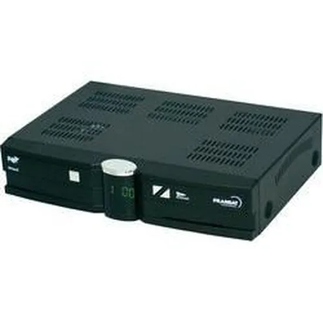
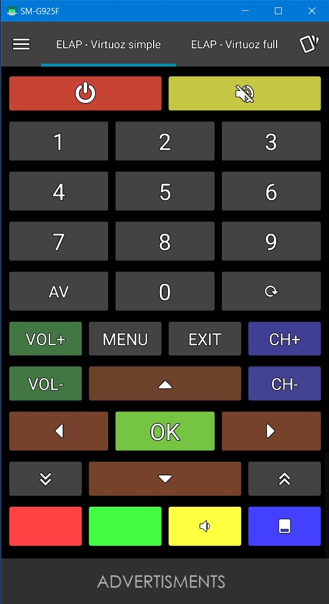
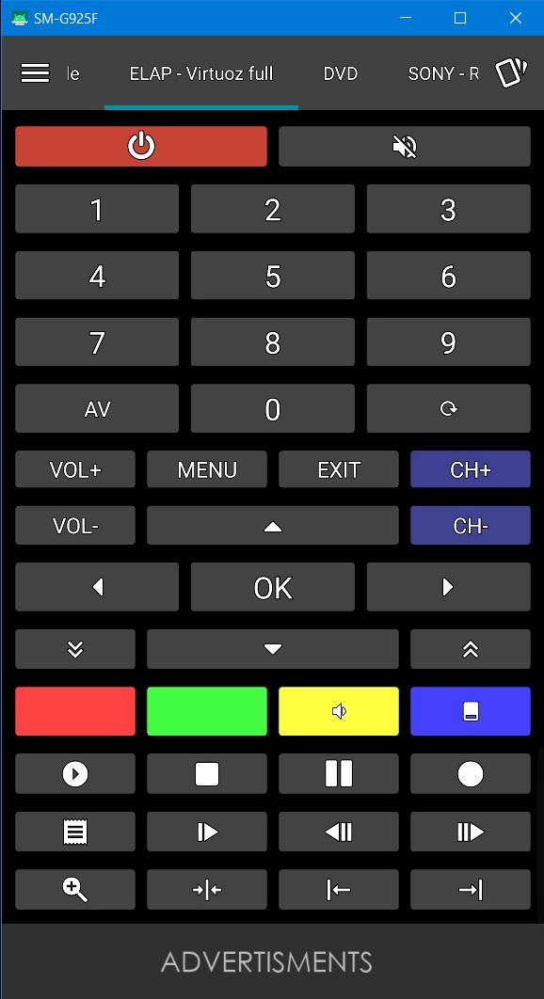

## Télécommande IR pour récepteur SAT ELAP virtuoz HD FRANSAT

Remplacement de la télécommande du récepteur sat ELAP Virtuoz HD FRANSAT. En effet cette télécommande trop bas de gamme est entrain de me lacher car les touches répondent de moins en moins bien.
Je n'ai pas pu trouver de télécommande IR pour ce récepteur donc je me suis rabattu vers une télécommande Android personnalisable.
Après plusieurs essais j'ai enfin trouvé la bonne appli:
IRplus permet de saisir les codes IR, sauvegarde des télécommandes format "matelecommande.irplus".
...

## la télécommande et le récepteur

## Ir-plus télécommandes - simple et full
<&nbsp>

