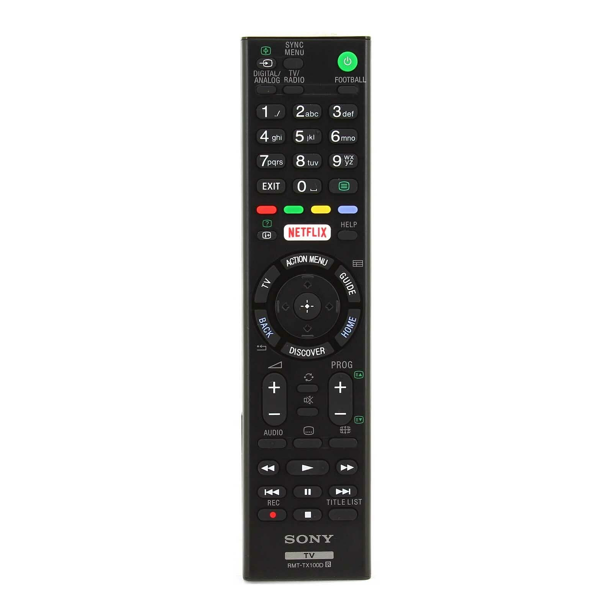
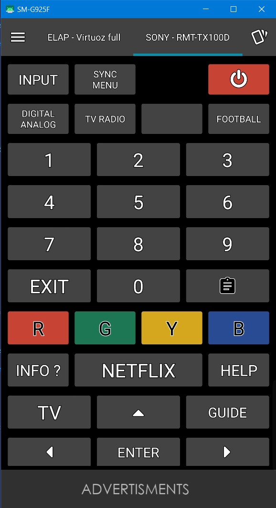

## Télécommande IR pour TV Sony BRAVIA

Encore une télécommande qui fonctionne mal. Mais cette fois pas de mal a en trouvé une sur https://fr.aliexpress.com/item/1005003192810516.html?spm=a2g0o.order_list.0.0.4d3e5e5b9suo3P&gatewayAdapt=glo2fra

Je me suis décidé à créer la telecommande pour IR-PLUS car je ne l'ai pas trouvé disponible.
Cela pourra servir ...

## la télécommande

## Ir-plus télécommande - SONY RMT-TX100D

